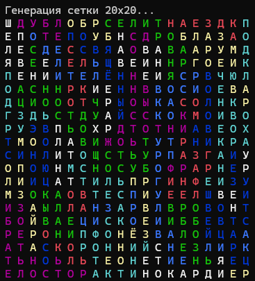
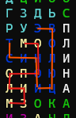

# WordsMatrixGenerator

WordsMatrixGenerator — это инструмент для автоматической генерации буквенных матриц (головоломок типа «Поиск слов», филвордов или сканвордов) на основе заданного списка слов. Программа эффективно распределяет слова по сетке в различных направлениях и заполняет оставшееся пространство случайными буквами.

---

## 🚀 Возможности

* Гибкая настройка сетки: Генерация матриц любого заданного размера ($N \times M$).
* Разнообразие направлений: Размещение слов по горизонтали, вертикали (как вперед, так и назад).
* Пересечение слов: Алгоритм оптимизирован для красивого пересечения слов между собой, что делает головоломку интереснее.
* Экспорт результатов: Генерация как самой матрицы с ответами, так и чистой сетки для игрока.

---

## 📸 Скриншоты и Демо

Вот примеры работы генератора:

### Сгенерированная матрица
Слева — Полная сетка, справа — вариант решения.

  
  

---

###### Описание сгенерировано Gemini
